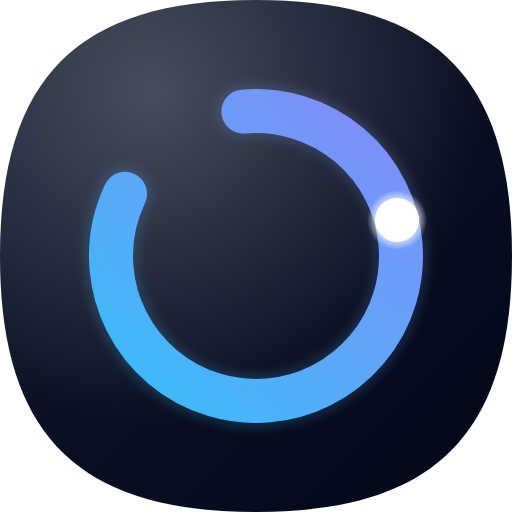

<p align="center">
  
</p>

<h1 align="center">Orka</h1>

<p align="center"><strong>Browse, visualize, schedule, and run AI skills — from a Mac app.</strong></p>

<p align="center"><em>Orka = <strong>Orchestrate</strong>.</em></p>

Author skills anywhere — Claude Code, ChatGPT, Cursor, or by hand. Orka is the management, execution, and observability layer that turns them into scheduled, monitored automations with native Mac output.

> Built on [Tauri 2](https://tauri.app/), React 19, and Rust. No servers, no cloud. SKILL.md is a cross-vendor open standard — works with Claude, OpenAI Codex, and any LLM that reads markdown.

---

## The Idea

Skills are the unit. A skill is one `SKILL.md` file — prose + optional frontmatter. Run one as a slash-command, chain several into a DAG, put one on a schedule. Orka adds the **management, execution, and observability** layer around them that cloud tools can't give you on your own machine.

```
Atomic skill     = one prompt, one SKILL.md
Composite skill  = multiple skills wired as a DAG, one SKILL.md with a graph block
Pipeline         = a composite skill on a schedule
```

One file format. Three runtimes:

| Runtime | Reads | Runs |
|---------|-------|------|
| Claude Code | Prose body | LLM follows the steps |
| Orka SkillRunner | Prose body + `examples:` + `inputs:` | `claude -p` subprocess, streamed to UI |
| Orka canvas (opt-in) | `<!-- orka:graph -->` block | Visual DAG, per-node streaming |
| `orka-cli run` | Prose + inputs | Delegates to `claude -p`, same trust store |

---

## Three Tabs

### Sessions — monitor active Claude sessions

Every `claude` session across all projects, with auto-generated briefs ("what's this session about, what did Claude just do"). Status badges for `generating` / `waiting-for-review`. Select multiple sessions and **Ask across** to query them all at once with live token streaming. Sound ping when a long-running session finishes.

### Skills — discover and run (default tab)

Left sidebar lists every skill, filterable. Header menu (`+ ▾`) unifies three ways to add one:
- **✨ Create new skill** — routes to the built-in `orka-skill-builder` meta-skill
- **📁 Import folder** — native folder picker copies a skill dir under `~/.orka/skills/`
- **🔗 Install from tap** — jumps to Trusted Sources, one-click git-based install

Click any skill and the right pane is a canvas-free runner:

- Always-visible **prompt textarea** that accepts natural language — no form to fill
- **Example chips** from the skill's `examples:` frontmatter, click to populate
- **Advanced** disclosure for structured `inputs:` when you need them
- **Run / Schedule / Evolve** controls; optional `◆ Edit in canvas` for composite skills
- First run opens a **trust modal** showing SHA-256 hash, declared `allowed-tools`, working directory, and prose-detected actions (bash, network, git push, etc). Approve once; re-prompts only on hash change.
- Output streams in with **per-block annotations** — hover any block, drop a note, batch all notes into one follow-up call via `Ask Claude with all notes`

Skills without examples show a `✨ Suggest examples` button that calls Sonnet to generate and persist them to SKILL.md. Or prewarm all missing ones at once from the sidebar banner.

### Runs — execution history

Every run (manual, scheduled, CLI) is logged to `~/OrkaCanvas/runs/YYYY-MM.jsonl`. Table: skill, timestamp, status, trigger, duration. One-click `🗑 Clear` wipes history.

### Studio (opt-in)

Canvas DAG editor for composite skills. Hidden by default — enabled via `?canvas=1` URL param or by opening a composite skill with `◆ Edit in canvas`. Node types: **Agent**, **Input**, **Skill ref**, **Output**. Dismissable tab that persists across restarts.

---

## The Flywheel

```
Chat with any AI (Claude Code, ChatGPT, Cursor, ...)
  → "automate this" → orka-skill-builder writes a SKILL.md
  → lands under ~/.orka/skills/<slug>/
  → Orka scanner picks it up (watcher + 2s cache)
  → run it from the Skills tab; first run trust-prompts
  → add notes on the output; batch "Ask Claude with all notes"
  → hit 💡 Evolve to fold your notes back into SKILL.md
  → schedule it; your skill library compounds
```

Every feedback loop stays inside Orka: run → annotate → evolve → run again. Nothing leaves the filesystem.

**Built-in meta-skills:**
- `orka-skill-builder` — creates new skills from a description
- `repo-tldr` — example importable skill in `docs/examples/`

Your skill library grows with every conversation. Skills you want available from the plain `claude` CLI: toggle the 🔗 on their card to symlink them into `~/.claude/skills/`.

---

## Output Destinations

Orka routes output to places cloud tools cannot reach:

- **Apple Notes** — JXA append
- **iCloud Drive** — direct file write
- **Local files** — anywhere on disk
- **HTTP webhooks** — WeChat Work, Slack, Notion, any URL
- **Shell commands** — `$CONTENT` substitution
- **Destination profiles** — named configs with saved credentials

---

## CLI

```bash
orka-cli list                              # show all discovered skills
orka-cli run morning-briefing              # run a skill headlessly
orka-cli run my-skill --inputs key=value   # with input bindings
orka-cli run my-skill --trust              # accept a hash change after review
```

Shares the TOFU trust store with the Tauri app (`~/OrkaCanvas/.trusted-skills.json`). Approving a skill in the GUI means `orka-cli` accepts it silently next run, and vice versa.

Suitable for cron, launchd, git hooks, or Raycast triggers.

### Perf bench

```bash
cargo run --bin orka-perf --release -- 30  # 30 iterations of hot paths
```

Times `list_projects`, `list_sessions`, `scan_skills_dirs`, and IPC round trip. Useful for catching regressions against your actual `~/.claude/` data. Or from the running app's DevTools:

```js
await window.__ORKA_PERF_SMOKE__()
```

---

## Prerequisites

Orka wraps the Claude CLI you already have:

1. **Install Claude Code**
   ```bash
   npm install -g @anthropic-ai/claude-code
   ```

2. **Log in once**
   ```bash
   claude
   ```

The built-in onboarding check on first launch verifies both.

---

## Install

Download the latest `.dmg` from [Releases](../../releases), drag to `/Applications`.

**First launch** (unsigned build):
- Right-click → Open → Open again. One-time only.
- Or: `xattr -cr /Applications/Orka.app`

Apple Silicon only for now.

---

## Develop

```bash
git clone https://github.com/jason-jz-zhu/orka.git
cd orka
npm install
npm run tauri dev
```

Requirements: Node 20+, Rust (stable), Xcode command-line tools.

```bash
npm run tauri build    # → src-tauri/target/release/bundle/dmg/
```

---

## Architecture

### Filesystem layout (where everything lives)

```
~/.orka/                          Orka-managed state (canonical)
├── skills/<slug>/                Skills you create/import in Orka
├── taps/<id>/                    Cloned tap repos (gstack, …)
├── custom-taps.json              User-added tap URLs
└── model-config.json             Per-feature model selection

~/.claude/                        Claude Code's territory (scanned, not owned)
├── skills/<slug>/                Hand-authored or tap-installed skills
├── skills/<slug>  → ~/.orka/...  Optional expose-symlinks (via 🔗 toggle)
└── projects/<key>/<sid>.jsonl    Session transcripts (read-only)

~/OrkaCanvas/                     Workspace state (per project if overridden
│                                 via $ORKA_WORKSPACE_DIR)
├── graph.json                    Current canvas DAG
├── templates/*.json              Saved composite pipelines
├── nodes/<runId>/                Per-run cwd; `claude -p` spawns here
├── annotations/<runId>.json      Output comment threads
├── runs/YYYY-MM.jsonl            Run history
├── .trusted-skills.json          TOFU hash pins for skill trust modal
└── .destinations.json            Credential profiles (0600)
```

### Rust backend (`src-tauri/src/`)

```
Core
  workspace.rs         Workspace + Orka-dir resolution, $ORKA_WORKSPACE_DIR
  skill_md/            SKILL.md parser + writer (frontmatter, graph block, examples)
  skills.rs            Multi-root scanner (Orka → global → workspace), mtime cache
  node_runner.rs       Spawns `claude -p` with stream-json, per-process-group kill
  sessions.rs          Session discovery, live-status detection, tail-seek reads
  run_log.rs           Append-only JSONL run history, atomic writes
  destinations.rs      Apple Notes / iCloud / webhook / shell dispatch

Skill lifecycle
  skill_import.rs      Folder-picker import → ~/.orka/skills/<slug>/
  skill_trust.rs       TOFU hash pinning + declared-permission surface
  skill_evolution.rs   Sonnet-backed SKILL.md rewrites from annotations
  suggest_examples.rs  Generate `examples:` chips for skills that lack them
  trusted_taps.rs      Git-clone + symlink installer for tap repos

LLM integration
  model_config.rs      Per-feature model picker (~/.orka/model-config.json)
  claude_gate.rs       Global semaphore (3 concurrent `claude` subprocesses)
  session_brief.rs     Haiku-backed per-session summary; tail-only JSONL read
  session_synthesis.rs Multi-session Q&A via stream-json, token-level emit

Observability
  perf_smoke.rs        End-to-end perf harness (cargo run --bin orka-perf)
  annotations.rs       Thread-shaped block annotations (Apple Notes mirror)
```

### React frontend (`src/`)

```
Entry points
  App.tsx              Tab router, lazy-loaded modals, workspace switcher
  components/SkillsTab.tsx       Default tab: list + runner
  components/SessionDashboard.tsx Sessions tab with auto-briefs
  components/RunsDashboard.tsx    Runs history table

Skill runner stack
  SkillRunner.tsx      Prompt textarea + examples + Advanced + Run
  SkillTrustModal.tsx  First-run consent with hash + declared tools
  SkillEvolutionModal  💡 Evolve flow
  OutputAnnotator +    Per-block comment threads, batched Ask-Claude
    BlockCard

Sessions stack
  SessionCard          Per-session card + brief preview
  SessionBriefCard     Auto-generated summary (throttled FIFO, Haiku)
  SynthesisModal       Multi-source cross-session Q&A, live streaming

State
  lib/skills.ts        Zustand store + FS watcher subscription
  lib/runs.ts          Run history store
  lib/annotations.ts   Thread-shape annotation store
  lib/perf.ts          Render-count + window.__ORKA_PERF_SMOKE__
```

### Key decisions

- **CLI subprocess, not Agent SDK** — SDK requires per-token API key billing. Wrapping the `claude` CLI inherits the user's Max/Pro subscription = zero marginal cost per run.
- **Filesystem as data model** — skills, runs, configs are all plain files. No database. Everything git-trackable, `cat`-able, `rm`-able.
- **`~/.orka/skills/` canonical, `~/.claude/skills/` optional** — Orka-managed skills land in its own root so the global Claude CLI namespace stays clean. A 🔗 toggle per skill creates a symlink for users who want CLI visibility.
- **TOFU trust** — every skill's SKILL.md is SHA-256 pinned on first run. Hash change → re-prompt. Shared between the Tauri app and `orka-cli --trust`.
- **Per-feature model config** — brief/synthesis/skillRun/evolution/suggestExamples each pick their own model. Defaults favor quality where it matters (Opus 4.7 1M for synthesis + skill runs) and speed where it doesn't (Haiku for briefs + evolution, Sonnet for example generation).
- **Global concurrency gate** — 3 permits across every code path that spawns `claude`, so N parallel node runs can't DDoS the user's machine.
- **Mac-only is a feature** — JXA, Apple Notes, iCloud, Shortcuts are structural advantages over cloud-based tools.

---

## Docs

- **[Orka Plan](docs/ORKA-PLAN.md)** — current strategic source of truth (vision, roadmap, metrics)
- [Pain Points](docs/PAINS.md) — 6 user pains with UX clone targets and implementation spec
- [Competition](docs/COMPETITION.md) — competitive coverage matrix and differentiation
- [Skill Format](docs/SKILL-FORMAT.md) — SKILL.md specification (v1)
- [Architecture](docs/ARCHITECTURE.md) — technical decisions and module map
- [Core Concepts](docs/CORE-CONCEPTS.md) — *(partially deprecated, preserved for history)*

---

## Status

Early beta. Expect rough edges:

- macOS only
- Unsigned build (Gatekeeper workaround required)
- No auto-updater yet
- `orka-cli` ships as a separate binary alongside the app

---

---

## Install & first-run

### Prerequisites
- **macOS 12+** (current release is Mac-only; Linux/Windows builds planned)
- **[Claude CLI](https://docs.claude.com/en/docs/claude-code)** installed and on your `$PATH`
- Run `claude` once in a terminal to complete its first-time authentication before opening Orka

### Gatekeeper (unsigned builds)
This is an early release and isn't code-signed by Apple yet. macOS will show
*"Orka can't be opened because the developer cannot be verified."*
Two ways to get past it (one-time per install):

1. **Recommended**: `xattr -cr /Applications/Orka.app` then double-click normally
2. **Alternate**: Right-click the app → **Open** → click **Open** in the warning dialog

### What Orka writes to your disk
| Path | Purpose | Safe to delete? |
|---|---|---|
| `~/OrkaCanvas/<workspace>/` | Per-workspace canvas graph, templates, run history, schedules, annotations | Yes — loses your workspace |
| `~/.orka/` | Per-user config: model selection, terminal preference, per-skill output folders | Yes — resets to defaults |
| `~/.orka/skills/` | Skills you authored or installed via Orka | Yes — loses your skills |
| `~/.claude/skills/<slug>` (symlink only, if you toggled the chain-link) | Exposes an Orka skill to the `claude` CLI | Yes — just unexposes it |

Orka **does not** touch `~/.claude/projects/` (session transcripts — Claude's domain), `~/.claude/.credentials.json` (auth — never read), or anything outside your home directory.

### First-launch bootstrap
- A demo `repo-tldr` skill is seeded into `~/.orka/skills/` on first run so the Skills tab isn't empty. Delete it any time — it stays deleted (we track a `~/.orka/.seeded-v1` marker).

### Known limitations (v0.1)
- **macOS only.** Several destinations (Apple Notes, iCloud Drive) and the Terminal-launcher integrations rely on AppleScript / `osascript`. Linux and Windows builds will gate or replace these.
- **One run at a time** by global design. Two scheduled fires at the same minute → second waits for the first. This is intentional rate-limiting; a semaphore caps concurrent `claude` subprocesses at 3.
- **No auto-updater.** Check the [Releases](https://github.com/jasonjzhu/orka/releases) page for new versions.
- **No built-in crash reporting.** If you hit a bug, open the Tauri DevTools (Cmd+Alt+I in dev builds; disabled in prod) or file an issue with repro steps.
- **Automation permission prompt** on first "⌨ Terminal" click — macOS will ask Orka for permission to control Terminal.app / iTerm. Grant once; the feature falls back to a clear error message if denied.
- **Home directory must be writable.** Orka cannot run on NFS-mounted or read-only homes (restricted accounts, shared-lab setups).

### Uninstall
Drag `Orka.app` to the Trash. Data in `~/OrkaCanvas/` and `~/.orka/` survives by design — delete those manually if you want a clean slate.

---

## License

MIT — see [LICENSE](LICENSE).
